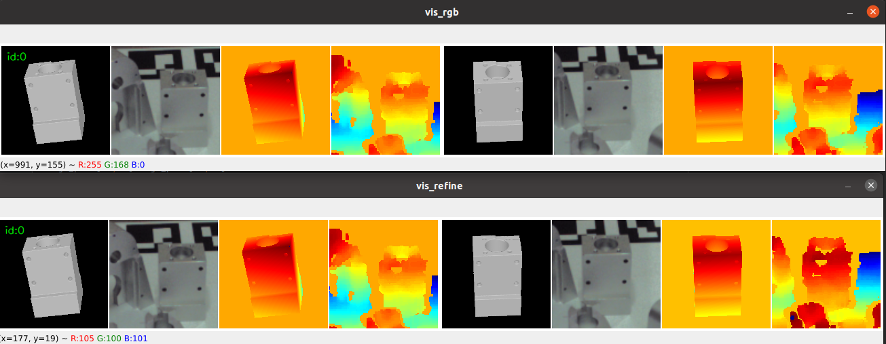
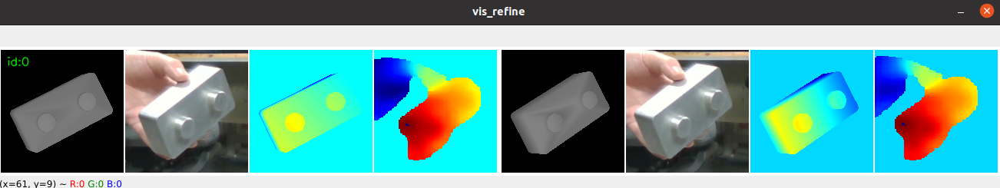
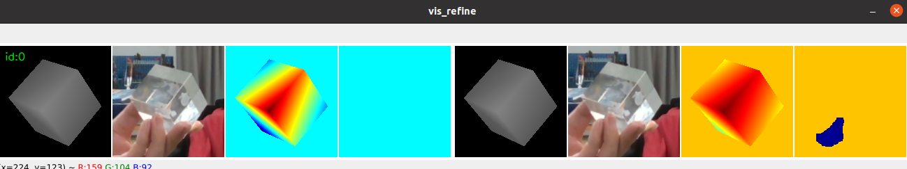

# FoundationPose_Train


A significant portion of FoundationPose's effectiveness can be attributed to its refinement module, which optimizes the initial pose and performs pose tracking. However, the refinement module requires RGBD input, which is not well-suited for transparent objects. To address this, we attempted to distill or train the refinement network. We conducted training experiments, but due to the large size of the FoundationPose dataset and its impracticality for direct use, we designed a method that generates data on-the-fly during training. Unfortunately, this approach proved to be inefficient, and the training results were suboptimal. We are open-sourcing this training code. If you are interested, you are welcome to try training with it.


# Compare the RGB refiner with the FoundationPose's refiner


# The result of the RGB refiner




# Installation
It is easy to install this code.

## 1. Install the FoundationPose
- Follow the [[FoundationPose]](https://github.com/NVlabs/FoundationPose)

# Train
```
python train.py
python train_add.py  # add ADD-(s) loss
```

- datasetloader.py
```
generate the train dataset.  "self.num_mesh" is the number of used meshes.
mesh = trimesh.load('./train_data/lmo_mp6d/obj_{:06d}.ply'.format(i))  ## path of the meshes
background_dir ### background
```

```
In founction "random_transform"
xy_offset #### the xy offset of the translation (m), follow Megapose, you can set 0.001
z_range   #### the z offset of the translation (m), follow Megapose, you can set 0.005
rot_offset #### the rotation offset (degree), follow Megapose, you can set 15
```

